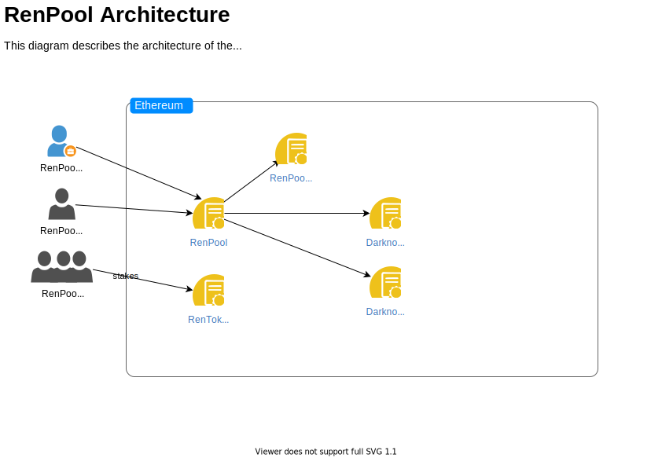
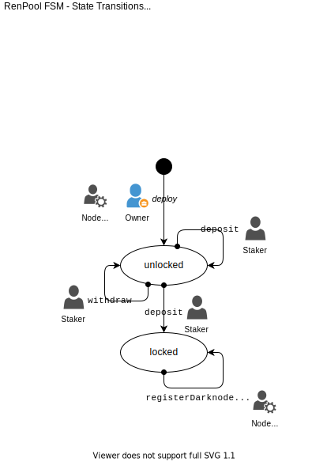

# RenPool Project

## Bringing community pools to the REN ecosystem

### What is REN?

RenVM is a permissionless and decentralized virtual machine protocol.

_A secure network of virtual computers that power interoperability for decentralized applications, enabling cross-chain lending, exchanges, collateralization & more._

More information about Ren can be found in <https://renproject.io/renvm>.

### How does the RenPool works?

At its core, RenPool is powered by smart contracts that dictates how the pool rewards are distributed among its users.



There are three main actors when using a RenPool.

- Owner
- Node Operator
- Stakers

In turn, the RenPool uses Ren smart contracts to interact with the RenVM in a decentralized and permissionless manner.

### RenPool states

The following picture shows different states the RenPool can be in.



When _unlocked_, stakers can either `deposit` or `withdraw` **REN** tokens as they see fit.
However, when the pool collects the Ren Bond, currently 100K **REN** tokens, it becomes _locked_.
Once the pool is _locked_, the node operator can register a new darknode.

> ***Please note that the REN tokens collected by the contract are never in possession of the node operator nor the owner.***

After the darknode has been registered,
it will start to earn fees.
The stakers can then withdraw their respective percentage of these fees.

## Getting started

The RenPool project uses the _Yarn_ package manager and the _Hardhat_ [https://hardhat.org/getting-started/](https://hardhat.org/getting-started/) development environment.

You can skip to the next section if you have a working _Yarn_ installation.
If not, here is how to install it.

```sh
npm install -g yarn
```

### Install project

```sh
yarn install
```

### Launch a python virtual env

```bash
>> python -m venv venv # create a new env called venv
>> source venv/bin/activate # activate it
>> deactivate # deactivate it once you are done
```

### Create a new file called `.env` from `.env.template`

Add your Metamask mnemonic and Infura project id

### Init brownie console

This will create a local blockchain plus 10 `accounts` loaded with eth associated to your Metamask

```sh
yarn hardhat console
```

### Mint a ERC20 token called REN and deploy RenPool contract to local net

You'll get a fresh instance every time you init the brownie console

```sh
>> renToken, renPool = run('deploy')
```

### You can now interact with the `renToken` and `renPool` contracts using any of the `accounts` provided by brownie and any of the contracts' methods

Get some ren tokens from the faucet

```sh
>> acc = accounts[1]
>> renToken.balanceOf(acc)
>> 0
>> renToken.callFaucet({'from': acc})
>> renToken.balanceOf(acc)
>> 1000000000000000000000
```

Deposit ren tokens into the ren pool

```sh
>> tx1 = renToken.approve(renPool, 100, {'from': acc})
>> tx2 = renPool.deposit(100, {'from': acc})
```

Verify that the ren pool balance has increased

```sh
>> renPool.totalPooled()
>> 100
```

Withdraw some tokens

```sh
>> renPool.withdraw(5, {'from': acc})
>> renPool.totalPooled()
>> 95
```

### Running tests (open a new terminal)

```bash
>> brownie test
```

## Manually deploy client app

[https://www.freecodecamp.org/news/how-to-deploy-a-react-application-to-netlify-363b8a98a985/](https://www.freecodecamp.org/news/how-to-deploy-a-react-application-to-netlify-363b8a98a985/)

Install Netlify CLI: `npm install netlify-cli -g`.

```bash
>> yarn run setEnv:<TARGET_NETWORK>
>> yarn run deploy
```

The app is deployed to [https://renpool.netlify.app/](https://renpool.netlify.app/)

## Deploy smart contract

1. Get a funded wallet for the target network
2. Set .env file pointing to the target network
3. run brownie console
4. renToken, renPool = run('deploy')

[https://www.quicknode.com/guides/vyper/how-to-write-an-ethereum-smart-contract-using-vyper](https://www.quicknode.com/guides/vyper/how-to-write-an-ethereum-smart-contract-using-vyper)

## Setup and deploy to test networks

1. [https://youtu.be/5jiqOUljfG8](https://youtu.be/5jiqOUljfG8)

2. [https://youtu.be/KNBneUpFaGo](https://youtu.be/KNBneUpFaGo)

3. Add kovan-fork to Development networks:
`brownie networks add Development kovan-fork host=http://127.0.0.1 cmd=ganache-cli  mnemonic=brownie port=8545 accounts=10 evm_version=istanbul fork=kovan gas_limit=12000000 name="Ganache-CLI (Kovan Fork)" timeout=120`

## Usage

1. Open the Brownie console. Starting the console launches a fresh [Ganache](https://www.trufflesuite.com/ganache) instance in the background.

    ```bash
    $ brownie console
    Brownie v1.9.0 - Python development framework for Ethereum

    ReactMixProject is the active project.
    Launching 'ganache-cli'...
    Brownie environment is ready.
    ```

2. Run the [deployment script](scripts/deploy.py) to deploy the project's smart contracts.

    ```python
    >>> run("deploy")
    Running 'scripts.deploy.main'...
    Transaction sent: 0xd1000d04fe99a07db864bcd1095ddf5cb279b43be8e159f94dbff9d4e4809c70
    Gas price: 0.0 gwei   Gas limit: 6721975
    SolidityStorage.constructor confirmed - Block: 1   Gas used: 110641 (1.65%)
    SolidityStorage deployed at: 0xF104A50668c3b1026E8f9B0d9D404faF8E42e642

    Transaction sent: 0xee112392522ed24ac6ab8cc8ba09bfe51c5d699d9d1b39294ba87e5d2a56212c
    Gas price: 0.0 gwei   Gas limit: 6721975
    VyperStorage.constructor confirmed - Block: 2   Gas used: 134750 (2.00%)
    VyperStorage deployed at: 0xB8485421abC325D172652123dBd71D58b8117070
    ```

3. While Brownie is still running, start the React app in a different terminal.

    ```bash
    # make sure to use a different terminal, not the brownie console
    cd client
    yarn start
    ```

4. Connect Metamask to the local Ganache network. In the upper right corner, click the network dropdown menu. Select `Localhost 8545`, or:

    ```bash
    New Custom RPC
    http://localhost:8545
    ```

5. Interact with the smart contracts using the web interface or via the Brownie console.

    ```python
    # get the newest vyper storage contract
    >>> vyper_storage = VyperStorage[-1]

    # the default sender of the transaction is the contract creator
    >>> vyper_storage.set(1337)
    ```

    Any changes to the contracts from the console should show on the website after a refresh, and vice versa.

## Ending a Session

When you close the Brownie console, the Ganache instance also terminates and the deployment artifacts are deleted.

To retain your deployment artifacts (and their functionality) you can launch Ganache yourself prior to launching Brownie. Brownie automatically attaches to the ganache instance where you can deploy the contracts. After closing Brownie, the chain and deployment artifacts will persist.

## Switching Networks

```sh
export WEB3_INFURA_PROJECT_ID=YourProjectID
brownie console --network mainnet-fork
```

## Further Possibilities

### Testing

To run the test suite.

```sh
yarn test
```

Runs the test suite and reports gas usage at then end.

```sh
yarn test:gas
```

Run test coverage.
Coverage report is written to `coverage/index.html`.

```sh
yarn coverage
```

Run `solhint` (solidity linter).

```sh
yarn lint
```

## Running Static Analysis

We use the [Slither](https://github.com/crytic/slither) to run static analysis on the RenPool contract.
Slither can run on a Hardhat application, so you only need to install Slither.

```sh
pip3 install slither-analyzer
```

To run it

```sh
slither .
```

See <https://github.com/crytic/slither> for more information.

The static analysis has been integrated into our pipeline with GitHub Actions.
To see the result of the analysis,
see <https://github.com/Ethernautas/renpool/actions/workflows/analysis.yaml>.

## Deploying to a Live Network

To deploy your contracts to the mainnet or one of the test nets, first modify [`scripts/deploy.py`](`scripts/deploy.py`) to [use a funded account](https://eth-brownie.readthedocs.io/en/stable/account-management.html).

Then:

```sh
yarn deploy --network kovan
```

Replace `kovan` with the name of the network you wish you use.
You may also wish to adjust Brownie's [network settings](https://eth-brownie.readthedocs.io/en/stable/network-management.html).

For contracts deployed on a live network, the deployment information is stored permanently unless you:

- Delete or rename the contract file or
- Manually remove the `client/src/artifacts/` directory

## Further read

1. [https://renproject.io/](https://renproject.io/)
2. [https://github.com/renproject](https://github.com/renproject)
3. [https://renproject.github.io/ren-client-docs/contracts/](https://renproject.github.io/ren-client-docs/contracts/)
4. [https://ethereum.org/en/developers/docs/standards/tokens/erc-20/](https://ethereum.org/en/developers/docs/standards/tokens/erc-20/)
5. Ren contract addresses on mainnet [https://renproject.github.io/contracts-ts/#/mainnet](https://renproject.github.io/contracts-ts/#/mainnet)
6. Ren contract addresses on testnet [https://renproject.github.io/contracts-ts/#/testnet](https://renproject.github.io/contracts-ts/#/testnet)
7. [https://media.consensys.net/an-definitive-list-of-ethereum-developer-tools-2159ce865974](https://media.consensys.net/an-definitive-list-of-ethereum-developer-tools-2159ce865974)
8. [https://docs.renproject.io/darknodes/getting-started/digital-ocean-or-how-to-setup-a-darknode/mac-os-and-linux](https://docs.renproject.io/darknodes/getting-started/digital-ocean-or-how-to-setup-a-darknode/mac-os-and-linux)

## How it Works from renpool.io

Get Access to Darknode Rewards without having to have 100k Ren or having to run a Darknode

Create a Pool to Deposit Ren into and when it gets to 100k Ren, we will register the pool and run the darknode for you.

Claim and Withdraw Rewards each Epoch. We do not have access to your rewards or your Ren.
graph
Withdrawing and Deregistering

We have developed a solution that offers users to get access to their Ren before the pool is deregisered. You simply request a withdraw and if anyone wants to take your spot, they transfer Ren to your wallet and you swap your ownership of the pool to them. You are out and have your Ren, however you will be sacrificing the current epoch rewards as a penalty, which goes to the proud new owners.

Once the pool collectively requests to withdraw more than 50K REN, Pool Owners can Deregister the Pool directly. This will initiate the Deregistering process within the Ren Protocol. Upon completion of the deregistration process, Pool Owners will be able to withdraw their credited Ren deposits.
RISKS CAUTION
Smart Contract Security

Security is our number 1 focus, however RenPool is a project that is currently unaudited and therefore all users must proceed with caution knowing that funds might be lost if hacks are found. We have a test plan that runs through the scenarios and have been very patient developing the contracts, however we are only human. Our intention is to develop a system that works as designed and benefits the ecosystem as a whole. We strive to lower the barrier to entry for users to get access to darknodes while offering opportunities for flexible withdraws and ultimately increase the amount of nodes being run to further secure the Republic Protocol. As we raise funds, we will proceed with the proper audits.
Darknode Operational Risks

When RenPools are Registered and the Darknode is being run by the RenPool team, if for any reason the Darknode is not run properly funds are at risk of being slashed. If a slashing is occurred, there are plans in the future of using DAO funds collected by fees to insure the slashing. Until the nodes are decentralized and the DAO is setup, there are risks of being slashed if the nodes are not running effectively. Users can be rest assured, we have been running darknodes successfully for many months now. We plan on finding a solution that further decentralizes the running of the darknode. Users will still be able to request withdraws and if there is >50% in agreement, the darknode can be de-registered and users can withdraw their funds upon completion of the epochs per the Ren Protocol.
Fees

Keep in mind that Ethereum Gas Fees can fluctuate quite a bit and can be very costly. In order to keep the RenPool operational fees are required to be collected. You can view the Fee breakdown below. Fees are subject to change and eventually the rates could be controlled by a future DAO.
Collected Fees FEES

Understanding the Fees of the system.
% of Ren Deposited into Pool

When depositing tokens into a pool there is a X% fee that will be required to deposit tokens. The rate could eventually be controlled by a DAO; initially it will be set at 5%. To reach a 100k Ren deposited for registering the RenPool, 105k Ren will be required to be deposited.
% of Rewards per Epoch

Each epoch collects rewards for running the darknode. The rewards will be available to be withdrawn from the Ren Protocol to the RenPools by the Pool Owners minus X%; which could eventually be a parameter controlled by a DAO. Initially the rate will be set at 5%. For example, if $1,000 worth of rewards are collected by the Pool per epoch, $50 would be retained as fees to the RenPool contract.
